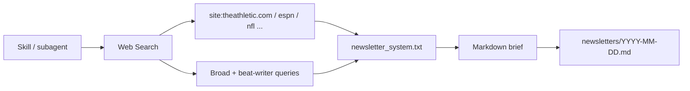

# Chicago Bears News Agent

A **Cursor subagent + skill** that pulls recent Chicago Bears news from **reputable web outlets**, then aggregates it into a **2–10 minute Markdown newsletter**. Uses **Cursor Web Search** only — no xAI, Grok, or X API subscription.

## What you get

- **National:** ESPN, The Athletic, NFL.com, CBS Sports, PFT, SI, Yahoo Sports  
- **Local:** Chicago Tribune, Sun-Times, NBC Sports Chicago, 670 The Score  
- **Community (context):** Windy City Gridiron, Bears Wire, Second City Football  
- **Beat / insiders:** Coverage citing Schefter, Rapoport, Hoge, Jahns, Fishbain, Biggs, Cronin  
- **Format:** TL;DR, headlines, injuries/roster, what’s next, cited sources  

Being a few minutes behind live X posts is expected; breaking news usually hits web outlets quickly.

## Quick start

In Cursor, ask:

- “Use the bears newsletter skill” or `/bears-newsletter`
- “Run the chicago-bears-newsletter subagent for the past 3 days”

No API keys or `pip install` required.

Optional: saved copies go to `newsletters/YYYY-MM-DD.md` when the agent has write access.

### Lookback

| Request | Window |
|---------|--------|
| Default | 3 days (`lookback_days_default` in config) |
| “Today only” | 1 day |
| “Past week” | 7 days |

## Use in Cursor

| Mechanism | How |
|-----------|-----|
| **Skill** | `/bears-newsletter` or “use the bears newsletter skill” |
| **Subagent** | `/chicago-bears-newsletter` or Task → `chicago-bears-newsletter` |
| **Cloud Agent** | Same skill/subagent; no secrets needed |

## How it works

- Search domains and queries live in `config/sources.json` (tiers: primary, local, national_nfl, bears_community).
- Editorial rules and output sections live in `scripts/prompts/newsletter_system.txt`.

## Customize sources

Edit `config/sources.json`:

- `web_sources` — add or remove domains by tier  
- `broad_search_queries` — extra topic searches  
- `people` — beat writers and insider name queries  
- `lookback_days_default` — default window  

## Scheduled delivery (optional)

Create a [Cursor Automation](https://cursor.com/automations) with a cron trigger and a prompt like:

> Follow the bears-newsletter skill: Web Search only, last 1 day, post the Markdown to Slack.

No environment secrets required for this workflow.

## Requirements

- Cursor with Web Search enabled (Chat, Agent, or Cloud Agent)

## License

MIT — use and fork freely; Bears fandom not included.
