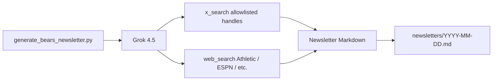

# Chicago Bears News Agent

A **Cursor subagent + skill** that pulls the latest Chicago Bears news from **X (Twitter)** and reputable web outlets, then aggregates it into a **2–10 minute Markdown newsletter** using **Grok 4.5** and xAI’s **X Search** / **Web Search** tools.

## What you get

- **National:** Adam Schefter, Ian Rapoport  
- **Outlets:** The Athletic, ESPN (via web search)  
- **Local beat:** Adam Hoge, Adam Jahns, Kevin Fishbain (+ Brad Biggs, Courtney Cronin in config)  
- **Format:** TL;DR, headlines, injuries/roster, what’s next, cited sources  

## Quick start

1. Get an API key from [xAI Console](https://console.x.ai/).
2. Copy env template and add your key:

   ```bash
   cp .env.example .env
   # export XAI_API_KEY=...   # or load .env in your shell
   ```

3. Generate today’s brief:

   ```bash
   pip install -r requirements.txt
   python3 scripts/generate_bears_newsletter.py
   ```

   Output is printed and saved to `newsletters/YYYY-MM-DD.md`.

### Options

```bash
python3 scripts/generate_bears_newsletter.py --days 1      # today-focused
python3 scripts/generate_bears_newsletter.py --days 7      # weekly catch-up
python3 scripts/generate_bears_newsletter.py --stdout-only
```

## Use in Cursor

| Mechanism | How |
|-----------|-----|
| **Subagent** | Ask: “Use the chicago-bears-newsletter subagent” or `/chicago-bears-newsletter` |
| **Skill** | `/bears-newsletter` or “use the bears newsletter skill” |
| **Cloud Agent** | Add `XAI_API_KEY` in [Cloud Agents secrets](https://cursor.com/dashboard/cloud-agents); repo includes `.cursor/environment.json` install step |

The subagent runs `scripts/generate_bears_newsletter.py` and returns the newsletter—no stale training-data summaries.

## How it works



- **X Search** uses `allowed_x_handles` from `config/sources.json` (up to 20 handles) and a date window (`--days`).
- **Web Search** prefers `theathletic.com`, `espn.com`, `chicagobears.com`, and `nfl.com`.
- Editorial rules live in `scripts/prompts/newsletter_system.txt`.

## Customize sources

Edit `config/sources.json`:

- `x_handles` — groups of handles (national / local / official)  
- `web_domains` — up to 5 domains per web_search call  
- `model` — default `grok-4.5`  

## Scheduled delivery (optional)

For a daily email or Slack digest, create a [Cursor Automation](https://cursor.com/automations) with a cron trigger and a prompt like:

> Run `python3 scripts/generate_bears_newsletter.py --days 1` in the chicago-bears-news-agent repo and post the Markdown output to Slack.

Store `XAI_API_KEY` in the automation’s environment secrets.

## Requirements

- Python 3.10+  
- `XAI_API_KEY` with access to Grok 4.5 and agent tools (`x_search`, `web_search`)  
- xAI [pricing](https://docs.x.ai/) applies per run (search + tokens)

## License

MIT — use and fork freely; Bears fandom not included.
